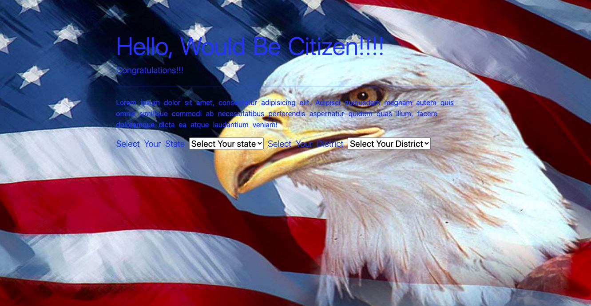

# javascriptPortfolio
# ABOUT THE PRODUCT
This web application is to help people who will be taking the civic test as part of the naturalization process in the United States. The landing page prompts 
users to select from a dropdown the state and district they reside so as to customize the answers to their state and district.
  
Once, the user selects state and the corresponding district, they will be directed to the quiz page where they need to match the question with the answer. In addition,
they can select flashcards to study all the questions that will be expected during the interview process. Users can also leave comments. 

# Technologies 
The project used the following set of technologies
<ul>
<li>Ruby</li>
<li>Rails</li>
<li>Javascript</li>
<li>Bootstrap</li>
</ul>
# Inspiration
As an immigrant, i used different website resources to practice the civic tests to get naturalized. In all the website i used, state and district information was not included. Some of the questions in the civic test asks for the names of the senators and representatives in the applicants state and district. This web app initially requests the user to select the state and district in which the user resides in. Based on this information, the answers are customized to reflect the state and district. 

# Contact 

* getu.gebre.gg@gmail.com 
* [ LinkedIn](https://www.linkedin.com/in/getugebre)

